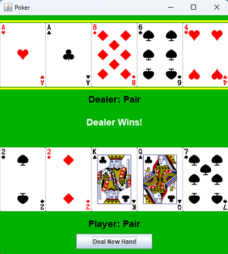

# 5 Card Poker Simulator

A Java-based poker game that evaluates and compares 5-card hands with a graphical interface built using Swing.

## Features
- Evaluates all poker hands (pair, flush, straight, etc.)
- Compares two hands with tie-breaking logic
- GUI displays cards for dealer and player
- Animated card dealing
- Highlights winning hand
- Play again functionality

## How to Run

Compile:
javac src/*.java

Run:
java -cp src Main

## Demo

